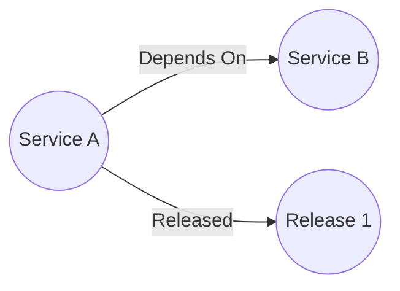

# Service Dependency API


A RESTful API service designed to map dependencies between services and provide basic information about services in your ecosystem.

_Note_ This API was designed as a project to learn Go. If you wish to use it, you can, but you should put it behind an API gateway or something to make it secure. 

## Overview

This API allows you to:

- Track services and their metadata (name, description, GitHub repo, etc.)
- Map dependencies between services
- Associate releases with services
- Query service relationships and dependencies

## Features

- Create, read, update, and delete services
- Map dependencies between services
- Track service metadata such as:
    - Name
    - Description
    - Database dependencies
    - GitHub repository
- Associate releases with services
- Ability to add technical debt to a service

## What is a "Service"
A service is any object that you wish to track as part of your catalog of objects. This can be databases, apis, servers, or anything else.
Service was chosen as the initial use case for this api was to catalog microservices and relations between them. Services can `depend_on` other services and have `releases` associated with them



## Debt
This application supports the recording and tracking of categorized technical debt as part of the database. Technical debt can fall into the categories below.

### Debt Types
| Type           | Notes                                                         |
|----------------|---------------------------------------------------------------|
| code           | code smells or localized poor code quality                    |
| documentation  | lack of documentation about app purpose, how tos, etc         |
| testing        | lack of types of testing                                      |
| architecture   | issues with design choices that affect the entire application |
| infrastructure | issues with the infrastructure stack the app runs on          |
| security       | security issues, such as using packages past EOL              |

### Debt Statuses
| Status      | Notes                                  |
|-------------|----------------------------------------|
| pending     | a new debt item                        |
| in_progress | actively being worked on               |
| remediated  | a debt item that is no longer an issue |

### Why track technical debt?
I think adding technical debt (or code rot) is a useful way to track and quantify issues with services. Things that are in your work tracking software (Jira, etc.)
may or may not always be picked up in a reasonable timeframe and may not be easily associated with the service in question. 

## Neo4j Data Structure
Services are created under a `Service` object, while releases are created under a `Release` object.
Services can have a `Depend_ON` relationship that may have a version as part of the relationship
Services `Released` a `Release`
Services `OWNS` a `Debt`

Releases will always have a date; releases without a date are assigned `now()` as the date. Releases may have an associated url, a version, or both, but require at least the url or a version to be present.

## Installation

### Prerequisites

- Go 1.21 or higher
- Neo4j database
- Docker and Docker Compose (optional, for local development)

### Using Docker Compose

1. Clone the repository
2. Start the Neo4j database:
   ```sh
   docker-compose up -d
   ```
3. Set the required environment variables:
   ```sh
   export NEO4J_URL=bolt://localhost:7687
   export NEO4J_USERNAME=neo4j
   export NEO4J_PASSWORD=1234%qwerT
   ```
4. Build and run the application:
   ```sh
   go build -o service-dependency-api ./cmd/service-dependency-api
   ./service-dependency-api
   ```

## Configuration

The application is configured using environment variables:

- `NEO4J_URL`: URL of the Neo4j database (default: none, required)
- `NEO4J_USERNAME`: Username for Neo4j authentication (default: none, required)
- `NEO4J_PASSWORD`: Password for Neo4j authentication (default: none, required)

The server listens on port 8080 by default.

## API Endpoints

For more information on endpoints, see the [Bruno Collection](./HTTP_COLLECTION) or the [OAS file](./_http_docs/service-dependency.yaml)
