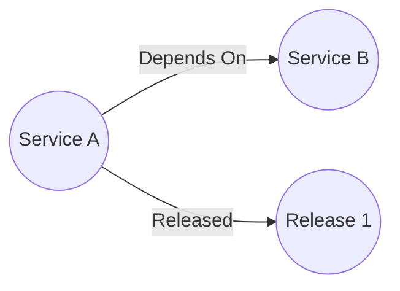

# Service Dependency API

A RESTful API service designed to map dependencies between services and provide basic information about services in your ecosystem.

## Overview

This API allows you to:

- Track services and their metadata (name, description, GitHub repo, etc.)
- Map dependencies between services
- Associate releases with services
- Query service relationships and dependencies

## Features

- Create, read, update, and delete services
- Map dependencies between services
- Track service metadata such as:
    - Name
    - Description
    - Database dependencies
    - GitHub repository
- Associate releases with services

## What is a "Service"
A service is any object that you wish to track as part of your catalog of objects. This can be databases, apis, servers, or anything else.
Service was chosen as the initial use case for this api was to catalog microservices and relations between them. Services can `depend_on` other services and have `releases` associated with them



## Neo4j Data Structure
Services are created under a `Service` object, while releases are created under a `Release` object.
Services can have a `Depend_ON` relationship that may have a version as part of the relationship
Services `Released` a `Release`

Releases will always have a date; releases without a date are assigned `now()` as the date. Releases may have a url, a version or both, but require at least a url or a version to be present.

## Installation

### Prerequisites

- Go 1.21 or higher
- Neo4j database
- Docker and Docker Compose (optional, for local development)

### Using Docker Compose

1. Clone the repository
2. Start the Neo4j database:
   ```sh
   docker-compose up -d
   ```
3. Set the required environment variables:
   ```sh
   export NEO4J_URL=bolt://localhost:7687
   export NEO4J_USERNAME=neo4j
   export NEO4J_PASSWORD=1234%qwerT
   ```
4. Build and run the application:
   ```sh
   go build -o service-dependency-api ./cmd/service-dependency-api
   ./service-dependency-api
   ```

## Configuration

The application is configured using environment variables:

- `NEO4J_URL`: URL of the Neo4j database (default: none, required)
- `NEO4J_USERNAME`: Username for Neo4j authentication (default: none, required)
- `NEO4J_PASSWORD`: Password for Neo4j authentication (default: none, required)

The server listens on port 8080 by default.

## API Endpoints

For more information on endpoints, see the [Bruno Collection](./HTTP_COLLECTION) or the [OAS file](./_http_docs/service-dependency.yaml)